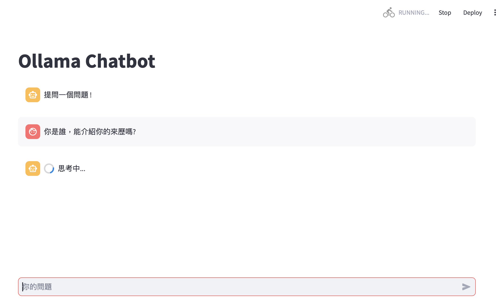
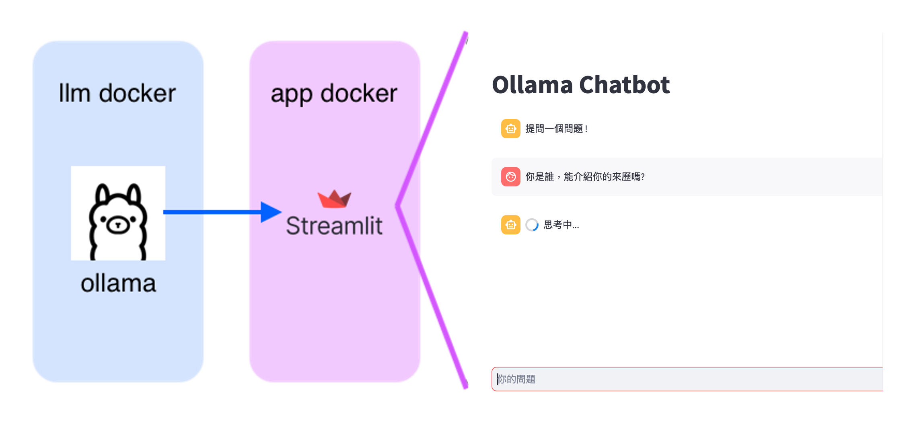

# Streamlit LLM 聊天機器人 (Llama 3)

使用 Facebook 的 Llama 3，這是 Streamlit 應用程式，它建立了兩個 Docker 容器，其中一個是本地運行在電腦上的 LLM (這可能會很慢)，另一個是前端應用程式，該應用程式會在 `localhost:8501` 上提供服務。可以選擇微調 Llama 3，但更有效的方法是讓 Llama 從建立的資料庫中提取資料，即檢索增強生成 (RAG)。



若要使用此git庫，需進行以下操作：

1. git clone 這個庫
2. 使用 `docker build -t streamlit-ollama .` 構建 Docker 容器
3. 執行 `docker-compose up`
4. 在容器中下載模型
5. 前往 `localhost:8501`

已添加 `.gitignore` 檔案，因為需要初始的 Llama 3 LLM 參數，這些參數可以下載到 `data` 資料夾中。需要在 Docker 容器中執行此操作，`yml` 檔案中的名稱會提供參數給以下命令，在容器中執行以下命令，以便下載模型：

```
docker exec -it streamlit-llm ollama run phi3.5
```

這會將模型下載到 `./data/ollama` 資料夾，該資料夾在容器內對應到 `/root/.ollama`。(順便提一下，當執行 LLM 時，它會在埠 11434 上提供服務，而 Streamlit 應用程式則會查詢該埠。)



## 背景

什麼是 `Ollama` 和 `Langchain`？它們是相輔相成的工具，協助開發人員更方便地使用 LLM。Ollama 是一個 Python 函式庫，執行開源 LLM (或使用金鑰呼叫付費的 LLM)。它提供了一個簡單的介面來與模型互動，使我們能夠傳送文字提示並接收回應 (以 json 格式)。我用過最有效的模型是 [Facebook](https://llama.meta.com/) 的，但它們相對較慢。

Ollama:

Gemini 其實提供了一個很好的類比：想像應用程式是一輛賽車。Ollama 就是賽車引擎的動力來源，而 Langchain 則是賽車的駕駛艙和控制裝置 (如方向盤、踏板等)。

## 嵌入

Ollama 也內建了取得嵌入向量的功能。在構建容器後 (當然，也可以選擇建立一個新的 Docker 映像)，可以進入容器並設置 Python3。

```
    1  ls
    2  cd /root
    3  apt update
    4  apt-get install python3
    5  apt install python3-pip
    6  pip install ollama
    7  pip install ipython
```

在 Python shell 中，可以進行如下操作：

```
import ollama
response = ollama.chat(model='llama3', messages = [ { 'role': 'user', 'content': "我正在測試 Python 介面。你好嗎？"},])
print(response['message']['content'])

embedding = ollama.embeddings(model= 'llama3', prompt= '我能得到一個嵌入向量嗎')
print(embedding['embedding'])
```

## 參考

以下是我查閱過的一些有用的部落格：

* [A B Vijay Kumar](https://abvijaykumar.medium.com/ollama-build-a-chatbot-with-langchain-ollama-deploy-on-docker-5dfcfd140363) - 基本上是以此為範本的。
* [Ollama 的 Python RAG 代碼](https://github.com/ollama/ollama/blob/main/examples/langchain-python-rag-document/main.py) - 來自 Ollama 的網站。
